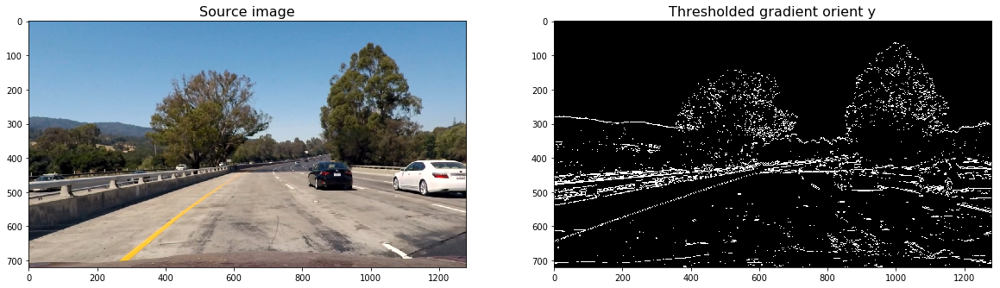
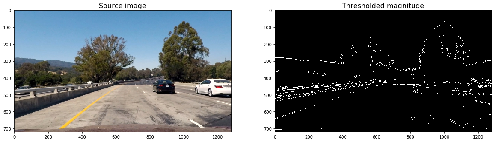
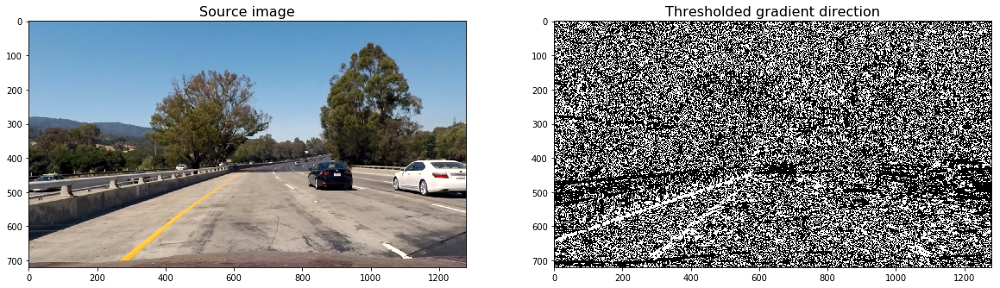
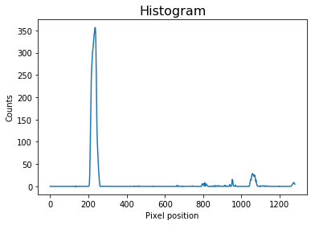
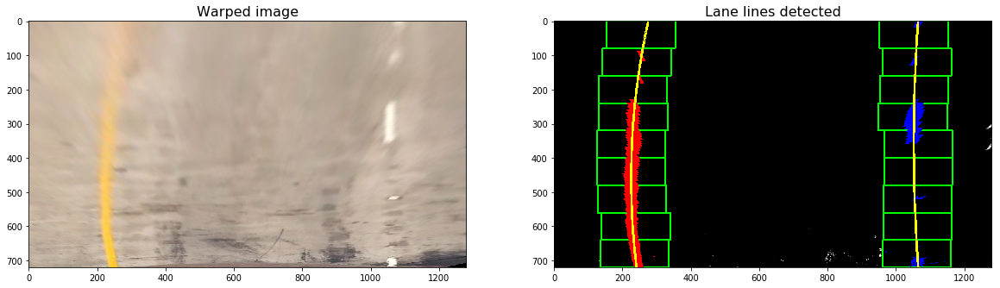

# **Advanced Lane Finding Project**

### Step 1: Calibrate camera using chessboard images

A set of chessboard images were used for this purpose. `calibrate_camera` function takes input parameters as a set of chessboards images, and the number of inside corners in the chess board in the _x_ and _y_ directions.

For each image path, `calibrate_camera`:
- reads the image by using the OpenCV [cv2.imread](https://docs.opencv.org/3.0-beta/doc/py_tutorials/py_gui/py_image_display/py_image_display.html) function, 
- converts it to grayscale using [cv2.cvtColor](https://docs.opencv.org/3.0.0/df/d9d/tutorial_py_colorspaces.html), 
- find the chessboard corners using [cv2.findChessboardCorners](https://docs.opencv.org/2.4/modules/calib3d/doc/camera_calibration_and_3d_reconstruction.html?highlight=calib)

Finally, the function uses all the chessboard corners to calibrate the camera by invoking [cv2.calibrateCamera](https://docs.opencv.org/3.0-beta/doc/py_tutorials/py_calib3d/py_calibration/py_calibration.html).

The values returned by `cv2.calibrateCamera` are used later to undistort the video images.

The complete code for this step is implemented in the cell[2] of the Jupyter Notebook.

### Step 2: Apply a distortion correction to raw images

Another OpenCv funtion, [cv2.undistort](https://docs.opencv.org/3.0-beta/doc/py_tutorials/py_calib3d/py_calibration/py_calibration.html), is used to undistort the images.

The result of undistorting one of the chessboard images is as under:

The complete code for this step is implemented in the cell[5] of the Jupyter Notebook.

### Step 3: Use color transforms, gradients, etc., to create a thresholded binary image.

The following funtions were used to calculate several gradient measurements (x, y, magnitude, direction and color).

- directional gradient: `abs_sobel_thresh()`.
- gradient magnitude: `mag_thres()`.
- gradient direction: `dir_thresh()`.
- color threshold: `col_thresh()`.

Then, `combine_threshs()` will be used to combine these thresholds, and produce the image which are used to identify lane lines in the later steps.

The result of applying each function to a sample image is as under:

- Compute the directional gradient in _x_ and _y_ directions:

- Compute the gradient magnitude 

- Compute the gradient direction 

- Compute the color threshold

The output image resulting of combining each threshold is as under:

### Step 4: Apply a perspective transform to binary image ("birds-eye view").

The next step in our pipeline is to transform the sample image to _birds-eye_ view.

The process involves the following steps:

- First, select the coordinates corresponding to a [trapezoid](https://en.wikipedia.org/wiki/Trapezoid) in the image, which would look like a rectangle from _birds_eye_ view.
- Then, define the destination points coordinates, i.e. how the trapezoid would look from _birds_eye_ view. 
- Finally, Opencv function [cv2.getPerspectiveTransform](https://docs.opencv.org/2.4/modules/imgproc/doc/geometric_transformations.html#getperspectivetransform) is used to compute both, the perpective transform _M_ and the inverse perpective transform _Minv.
- _M_ and _Minv_ will be used respectively to warp and unwarp the video images.

The result of warping an image after transforming its perpective to birds-eye view is as under:

The code for the `warp()` function can be found in cell[19] of the Jupyter Notebook.

### Step 5: Detect the lane pixels and fit quadratic polynomials to find the lane boundary.

 In order to detect the lane pixels from the warped image, the following steps were performed.
 
 - First, a histogram of the lower half of the warped image is created. The histogram can be seen below and the code used to produce is in cell[21] of the Jupyter Notebook.

- Then, the starting left and right lanes positions are selected by determining the maximum value of the histogram to the left and the right of the histogram's mid position.
- A technique known as _Sliding Window_ is used to identify the most likely coordinates of the lane lines in a window, which slides vertically through the image for both the left and right line.
- Finally, using the coordinates previously calculated, a second order polynomial is fitted on both the left and right lane line. Numpy's function [np.polyfit](https://docs.scipy.org/doc/numpy/reference/generated/numpy.polyfit.html) will be used to calculate the polynomials.

The result of applying the `find_lane_pixels` function to the warped image is as under:

The complete code for this step can be found in the cell[23] of the Jupyter notebook.

Once the lanes lines are selected, it is reasonable to assume that the lines will remain there in future video frames.
`search_around_poly_fit` function uses the previosly calculated _line_fits_ to try to identify the lane lines in a consecutive image. If it fails to calculate it, it invokes `find_lane_pixels` function to perform a full search.

### Step 6: Determine the curvature of the lane, and vehicle position with respect to center.

Now, radius of curvature and the car offset is estimated. The code for these measurements is in cells[27] and [29] respectively of the Jupyter Notebook.

### Step 7: Warp the detected lane boundaries back onto the original image.

Since the lane lines are already identified along with their radius of curvature and the car offset.

The next step is to draw the lanes on the original image:

- First, the lane lines are drawn on the warped blank version of the image.
- Then, the lane lines are drawn on the warped blank image using the Opencv function [cv2.fillPoly](https://docs.opencv.org/2.4/modules/core/doc/drawing_functions.html#fillpoly). 
- Finally, the blank will be warped back to original image space using inverse perspective matrix (Minv).

This code is implemented in the `draw_lane` function, which is implemented in cell[31] of the Jupyter notebook.

An example of its output can be observed below:

### Step 8: Display lane boundaries and numerical estimation of lane curvature and vehicle position.

The next step is to annotate metrics on the image. A function named `add_metrics` receives an image and the line points and returns an image which contains the left and right lane lines radius of curvature and the car offset. 

This function makes use of the previously defined `measure_curvature_real` and `car_offset` function.

The output image after invoking `add_metrics` function is as under:

This function can be found in the cell[33] of the Jupyter notebook.

### Step 9: Run pipeline in a video.

In this step, all the previous steps to create a pipeline that can be used on a video.

Create the `ProcessImage` class, a class instead of a method is used because it would calibrate the camera when initialized and also keep track of the previously detected lanes lines. The code for the class is in the cell[35] of the Jupyter Notebook.

MoviePy's [VideoFileClip](https://zulko.github.io/moviepy/_modules/moviepy/video/io/VideoFileClip.html) class is used to read the input video. Then, [fl_image](https://zulko.github.io/moviepy/ref/VideoClip/VideoClip.html#moviepy.video.VideoClip.VideoClip.fl_image) is used to process each frame with our `ProcessImage` class. 

Finally, the output video is compiled using https://zulko.github.io/moviepy/ref/VideoClip/VideoClip.html#moviepy.video.VideoClip.VideoClip.write_videofile 

## Discussion

This has been a really challenging project. However, there are still room for improvements, which are listed as under:

- Like, keeping track of the last several detections of the lane lines, so that they can be used for better new detections.
- Incorporating checks to confirm that the detected lane lines are real, for e.g.:
  - checking that they have similar curvature,
  - checking that they are separated horizontally approximately by the same right distance,
  - checking that they are roughly parallel.
- Smoothing:
  - Even when everything is working, line detections jumps around from in a few frames so it is preferable to smooth over the last n number of video frames to obtain a bit cleaner result. Also, each time a new high-confidence measurement is calculated, it can be appended  to the list of recent measurements and then an average over n past measurements can be taken to obtain the lane position. 

Finally, the pipeline might fall if a white car is too close to the left or right lanes, and also when a white car is in front of the car or quite close to it.

